# Technical and Design Documentation: Embedded Bird Classifier

**Project Authors:** Emil Siatka, Mateusz Szwagierczak  
**Release Date:** June 2026  
**System Version:** 1.0.0  
**Base Platform:** Raspberry Pi 4 Model B (2GB RAM)  
**Operating System:** Raspberry Pi OS (64-bit, Debian Bookworm based)

---

## 1. Introduction and Project Objective

The **Embedded Bird Classifier** project is an autonomous, integrated embedded device designed for long-term, field acoustic monitoring of avifauna (birds). The system is engineered to operate in harsh environmental conditions (the so-called "forest mode"), without permanent access to network infrastructure or an external grid power supply.

### Key Functional Requirements:

- **Autonomous Continuous Monitoring:** Cyclic recording of environmental audio samples using a dedicated audio path.
- **Local AI Analysis (Edge Computing):** Real-time processing and classification of recordings directly on the device using deep learning algorithms (`BirdNet`).
- **Isolated Field Data Distribution:** Emitting its own Wi-Fi Access Point (Hotspot), enabling wireless data downloads and results preview on mobile devices or computers without internet usage.
- **Secure Storage Management:** Aggregating trimmed audio samples and logs into structured JSON files with the capability to export them to a compressed ZIP archive and remotely clear the flash memory.

---

## 2. Hardware Specification and Architecture

The device features a modular design built upon COTS (Commercial Off-The-Shelf) components, ensuring structural repeatability and ease of maintenance.

| Component                 | Model / Manufacturer          | Role in the System                                                                   | Technical Specification / Notes                                                                                                     |
| :------------------------ | :---------------------------- | :----------------------------------------------------------------------------------- | :---------------------------------------------------------------------------------------------------------------------------------- |
| **Central Unit**          | Raspberry Pi 4 Model B        | Main computing processor, hosting the operating system, AI analysis, API/Web server. | Broadcom BCM2711 (Quad-core Cortex-A72 @1.5GHz), 2GB LPDDR4 RAM, built-in 2.4/5.0 GHz Wi-Fi module.                                 |
| **Power System**          | Xiaomi Powerbank              | Autonomous energy source, UPS buffer functionality.                                  | Support for pass-through charging technology (simultaneous battery charging and powering the minicomputer from an external source). |
| **Audio Input Interface** | Esperanza lavalier microphone | Capturing acoustic signals from the environment.                                     | Omnidirectional characteristic, frequency response tailored for recording nature sounds.                                            |
| **ADC Converter**         | LogiLink USB Sound Card       | Digitizing the analog signal from the microphone.                                    | Chipset supporting Plug&Play standard in Linux, dedicated 3.5 mm TRS microphone input.                                              |
| **External Enclosure**    | S-BOX electrical box (Pawbol) | Protecting components from weather conditions.                                       | IP65 waterproof rating, made of high mechanical strength polypropylene.                                                             |

### Physical Integration and Sealing:

Components inside the S-BOX container have been immobilized using power cables and nylon cable ties (zip ties), protecting them from mechanical damage during transport. The audio path was routed outside the enclosure through a factory cable gland. The microphone outlet and critical structural connections were sealed with hot-melt glue, ensuring excellent insulation against moisture and rain. Outside the box, the microphone is shielded by a dedicated, perforated protective grille.

#### Visual Documentation of Hardware Components:

<p align="center">
  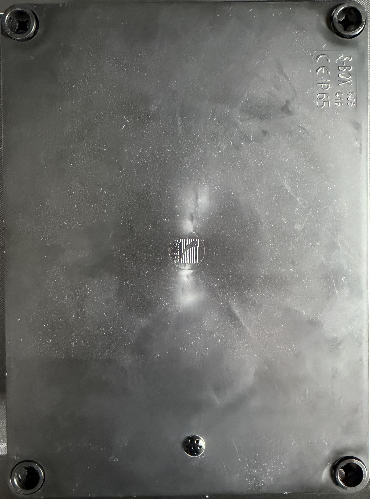<br>
  <sub><b>Figure 1:</b> Autonomous measurement capsule in the S-BOX enclosure with a routed and secured microphone at the bottom.</sub>
</p>

<p align="center">
  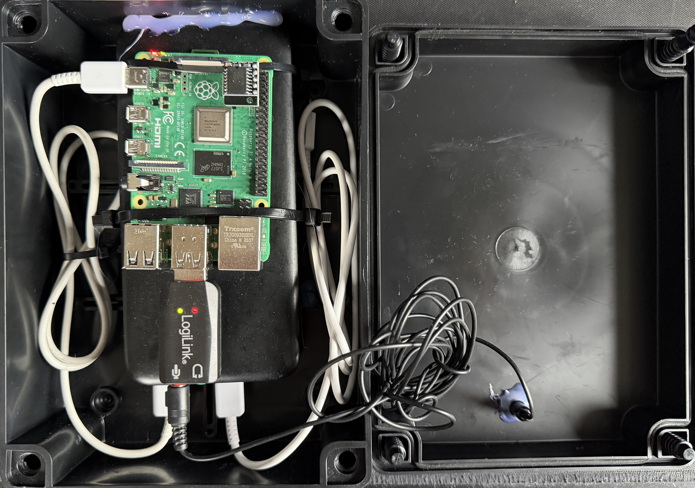<br>
  <sub><b>Figure 2:</b> Component layout inside the electrical box. Visible securing of the Raspberry Pi 4, buffer powerbank, and the miniature LogiLink USB sound card.</sub>
</p>

---

## 3. Software Architecture and Tech Stack

The system operates on a multi-process architecture, consisting of independent yet closely cooperating system services and application modules.

### Tech Stack:

- **Operating System:** Raspberry Pi OS (64-bit), optimized by disabling power-saving subsystems (complete acpi/sleep blocking via `systemctl mask`).
- **Backend:** Python 3.11+ embedded in an isolated virtual environment (`venv`). Key libraries: `FastAPI` (REST API server), `uvicorn` (ASGI server), `birdnetlib` (local inference of the TensorFlow Lite model), `watchdog` (reactive file system event monitoring), `sounddevice` and `scipy` (audio buffer management and WAV writing), `pydub` (audio file manipulation).
- **Frontend:** Single Page Application (SPA) built using the `React` framework and the `Vite` build tool. Styling implemented with `TailwindCSS`, the `Lucide React` icon set, and dynamic chart components from `Recharts`.

### Project Directory Structure:

```text
/home/user/bird_classifier/
├── autorun_logs.md                 # Autostart diagnostic logs
├── bird_images/                    # Local database of bird species images for the UI
├── frontend/                       # Source code of the React application (Vite)
│   ├── index.html
│   ├── package.json
│   ├── tailwind.config.js
│   └── src/
│       ├── App.jsx                 # Main dashboard interface
│       ├── main.jsx
│       └── index.css
├── frontend.log                    # Output logs of the Vite development server
├── Raspberry_config-PL.md          # Basic deployment manual
├── requirements.txt                # Pip dependencies for Python
├── run.sh                          # Main process orchestration script
├── setup.sh                        # Installation and configuration script
├── src/                            # Backend scripts (Core)
│   ├── __init__.py
│   ├── analyzer.py                 # AI classification and file change detection process
│   ├── log_reader.py               # Audio segmentation module (pydub)
│   ├── recorder.py                 # Continuous microphone recording process
│   └── server.py                   # Main FastAPI server + static file serving
└── running/                        # Dynamic system working directory (Runtime)
    ├── export.zip                  # Temporary data export package
    ├── analizing_results/          # Session report files in JSON format
    ├── new_audio_samples/          # Input buffer for raw WAV files (9s)
    └── saved_audio_samples/        # Chronological subdirectories with segmented samples
```

The correct deployment of the file structure and the execution flags of the shell scripts can be verified via the Linux file listing:

<p align="center">
  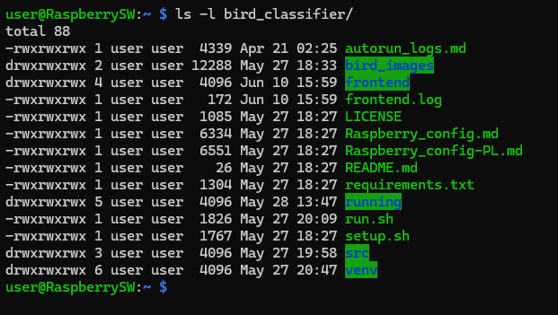<br>
  <sub><b>Figure 3:</b> Checking the structure of the operating environment and execution flags (+x) for run.sh and setup.sh.</sub>
</p>

---

## 4. Data Flow in the System

The system operates as a closed data processing loop without human intervention:

```text
[ Environment ]
      │ (Analog Audio)
      ▼
[ Microphone + USB Card ] ──(48kHz PCM)──> [ src/recorder.py ]
                                                 │
                                                 ▼ (Saving audio_*.wav file every 9 sec)
                                          [ running/new_audio_samples/ ]
                                                 │
                                                 ▼ (Watchdog on_created event)
                                          [ src/analyzer.py ]
                                                 │
                    ┌────────────────────────────┴────────────────────────────┐
                    ▼ (BirdNet TFLite Inference)                              ▼ (Segment Clipping)
           [ Classification Results ]                                  [ src/log_reader.py ]
                    │                                                         │
                    ▼ (Data Formatting)                                       ▼ (pydub WAV Exporter)
     [ running/analizing_results/analysis_*.json ]               [ running/saved_audio_samples/[Session]/ ]
                    │                                                         │
                    └────────────────────────────┬────────────────────────────┘
                                                 ▼
                                         [ FastAPI Server ]
                                                 │
                                                 ▼ (HTTP/REST API)
                                      [ Dashboard UI (React) ]
```

1.  **Signal Registration:** The `recorder.py` module opens an input stream on the designated audio device (LogiLink sound card). It samples the mono signal at 48 kHz. Every 9 seconds, the buffer content is written to an `audio_[TIMESTAMP].wav` file in the `new_audio_samples` temporary directory. A pseudo-graphic volume unit meter (VU-meter) is generated in the console to depict the volume level.
2.  **New Sample Detection:** The `analyzer.py` script utilizes the `watchdog` mechanism to monitor the `new_audio_samples` directory. Detecting a creation event (`on_created`) for a `.wav` file pauses the thread for 1 second (a buffer preventing data racing on slow SD cards), then forwards the file to the analysis engine.
3.  **AI Classification:** The `BirdNetLib` engine initializes the local TensorFlow Lite model, passing geographical coordinates (default Warsaw: lat=52.2, lon=21.0) to improve prediction accuracy by filtering out species that do not occur in that specific biogeographical zone.
4.  **Preservation and Segmentation:** If the model detects a bird with the required confidence threshold, the file path and the full array of detections are passed to the `analyzer.py` process. The system opens or appends the record to the `analysis_[SESSION].json` file. Concurrently, the `log_reader.py` module (utilizing `pydub`) cuts the exact time segment (`start_time` to `end_time`) where the model identified the vocalization from the 9-second base file, and exports it as a small `.wav` file into the chronological structure.

The resulting JSON file structure aggregates nested detections along with the full taxonomy provided by the BirdNet engine:

<p align="center">
  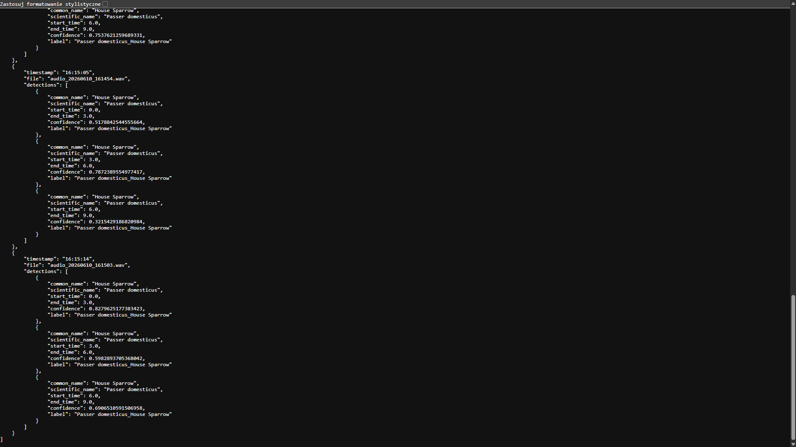<br>
  <sub><b>Figure 4:</b> Preview of the JSON key structure sent to the frontend, containing timeframes and prediction probability (confidence).</sub>
</p>

5.  **Data Consumption:** The FastAPI server exposes REST endpoints and mounts static file access points. The React frontend application polls the server at a 5-second interval (Live-Reload), fetching the freshest detection data and rendering charts as well as an interactive audio player.

---

## 5. Backend Implementation (Python)

### 5.1. `src/recorder.py`

Process responsible for low-level audio device I/O operations. Implements automatic USB microphone discovery.

```python
# Key fragment of the audio buffer registration mechanism
def record(device_id):
    samplerate = 48000
    channels = 1
    timestamp = datetime.now().strftime("%Y%m%d_%H%M%S")
    file_path = os.path.join(FOLDER_AUDIO, f"audio_{timestamp}.wav")
    recording_buffer = []

    def callback(indata, frames, time_info, status):
        # Calculating the modulation level and rendering the VU bar in the console
        volume_norm = np.linalg.norm(indata) * 20 / np.sqrt(len(indata))
        recording_buffer.append(indata.copy())
        level = min(int(volume_norm * BAR_LENGTH), BAR_LENGTH)
        bar = "█" * level + "-" * (BAR_LENGTH - level)
        print(f"\rRecording (ID:{device_id}): [{bar}]", end="", flush=True)

    with sd.InputStream(samplerate=samplerate, channels=channels, callback=callback, device=device_id):
        time.sleep(RECORDING_DURATION)

    full_recording = np.concatenate(recording_buffer, axis=0)
    write(file_path, samplerate, full_recording)
```

### 5.2. `src/analyzer.py`

The analytical core of the system. Operates based on Event-Driven Architecture.

```python
class BirdWatchHandler(FileSystemEventHandler):
    def on_created(self, event):
        if event.is_directory or not event.src_path.lower().endswith(".wav"):
            return

        time.sleep(1) # Protecting IO from incomplete file write
        try:
            recording = Recording(analyzer, event.src_path, lat=52.2, lon=21.0)
            recording.analyze()

            if recording.detections:
                # Operational block for incremental writing to the JSON file
                if not os.path.exists(file_path):
                    with open(file_path, "w", encoding="utf-8") as f: json.dump([], f)

                record_data = {
                    "timestamp": os.path.basename(event.src_path)[6:-4],
                    "file": os.path.basename(event.src_path),
                    "detections": recording.detections
                }

                with open(file_path, "r+", encoding="utf-8") as f:
                    data = json.load(f)
                    data.append(record_data)
                    f.seek(0)
                    json.dump(data, f, indent=4, ensure_ascii=False)
                    f.truncate()

                # Calling the external audio extraction submodule
                segment_audio_parts(recording.detections, event.src_path, SESSION_WAV_DIR, f"{os.path.basename(event.src_path)[:-4]}")
        except Exception as e:
            print(f"Analysis error: {e}")
```

### 5.3. `src/server.py`

FastAPI server exposing the application programming interface (API) and performing storage wiping as well as on-the-fly ZIP archive creation.

- `GET /api/results`: Returns a list of recorded sessions (`.json` files) sorted descending (newest on top).
- `GET /api/export`: Dynamically packs the entire structure of `analizing_results` and session folders from `saved_audio_samples` into a single optimized ZIP archive. This prevents download data fragmentation.
- `DELETE /api/clear`: Performs a cascade removal of all output data from the SD memory card, restoring the system to a clean state (system response visible in the `confirmation_deletion.png` screenshots).

---

## 6. User Interface (Frontend - React)

The client application implements an Operational Dashboard design pattern running in Dark Mode.

### Key Mechanisms Implemented in `App.jsx`:

1.  **Avoiding Stale Closures in Asynchronous Intervals:** An advanced pattern with a `useRef` reference was applied to maintain the active file state:
    ```javascript
    const selectedFileRef = useRef(selectedFile);
    selectedFileRef.current = selectedFile;
    ```
    This ensures that the running `setInterval` process (executing every 5 seconds) always has access to the session currently selected by the user, allowing seamless background chart refreshes without interrupting user interaction (no loading screen flickering effect).
2.  **Chart Data Aggregation:** The `generateChartData` function maps the nested detection structure from the JSON format into a flat associative structure, counting the occurrences of unique species (`common_name`), and then sorts the results in descending order. The result is passed to the `<BarChart>` component from the `recharts` library.
3.  **Media Handling and Cache-Busting:** Audio sample and JSON report URLs are parameterized with a unique timestamp (`?t=${new Date().getTime()}`). This prevents aggressive file caching by mobile browsers (e.g., Google Chrome on Android/iOS), forcing a fresh retrieval of the updated file from the FastAPI server during live monitoring.

#### Showcase of Graphical User Interface (UI) States:

<p align="center">
  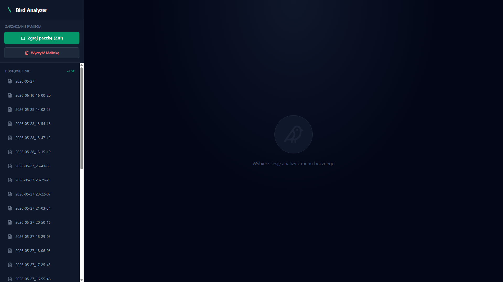<br>
  <sub><b>Figure 5:</b> View of the main panel after device boot (waiting for a recorded session selection).</sub>
</p>

<p align="center">
  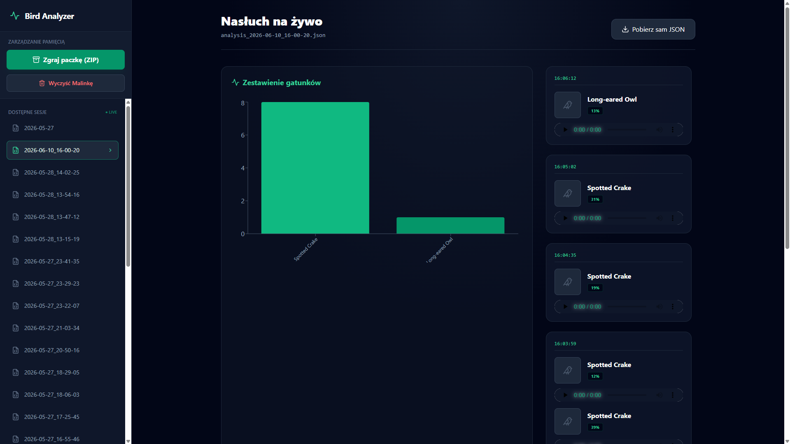<br>
  <sub><b>Figure 6:</b> Analysis of the selected session file. On the right, a chronological preview of detections is visible, and in the central part, an aggregated bar chart for the Spotted Crake and Long-eared Owl species.</sub>
</p>

<p align="center">
  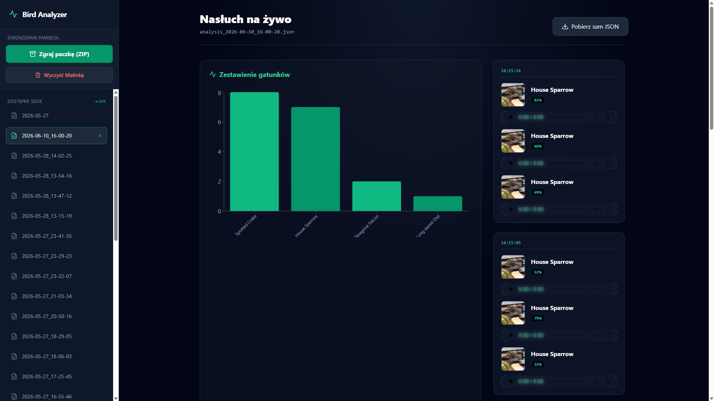<br>
  <sub><b>Figure 7:</b> Automatic mapping and fetching of images from the local database (example for the House Sparrow species) during active data streaming.</sub>
</p>

<p align="center">
  <br>
  <sub><b>Figure 8:</b> Responsive view of the sidebar memory management menu and session list displayed directly on a smartphone screen.</sub>
</p>

---

## 7. System Environment, Autostart, and Field Deployment

The device operates fully autonomously due to the configuration of system services and the network manager at the Linux kernel layer.

### 7.1. Network Configuration (Field Access Point)

Using the NetworkManager tool (`nmcli`), the `wlan0` network card is switched to AP (Access Point) mode:

```bash
sudo nmcli device wifi hotspot ifname wlan0 ssid DrzewoBirdNET password HasloDoDrzewa
sudo nmcli connection modify Hotspot connection.autoconnect yes
```

This configuration forces the system to assign a static gateway IP address: `10.42.0.1`.

<p align="center">
  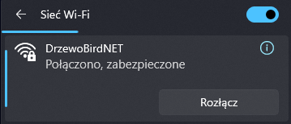<br>
  <sub><b>Figure 9:</b> Checking the established Wi-Fi connection with the field research subnetwork "DrzewoBirdNET".</sub>
</p>

### 7.2. Windows Integration (Samba Server)

To enable direct file management bypassing the web interface, the Samba daemon (`smbd`) was configured to share the user's home directory over the local network. In the `/etc/samba/smb.conf` section, the following was defined:

```ini
[Raspberry]
   path = /home/user
   writeable = yes
   browseable = yes
   public = no
   create mask = 0644
   directory mask = 0755
   force user = user
```

Access to the flash storage file system from the client workstation OS is handled natively via the SMB protocol:

<p align="center">
  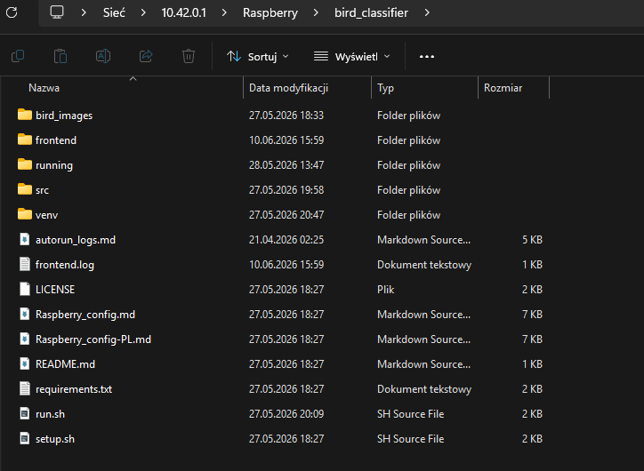<br>
  <sub><b>Figure 10:</b> Mapping network resources and project source files directly in Windows Explorer under the gateway IP address.</sub>
</p>

### 7.3. Orchestration and Autostart (Systemd)

The dedicated `birdnet.service` ensures the automatic launch of the `run.sh` script immediately after the audio and network subsystems are initialized by the system kernel, as well as an automatic restart in case of a process failure.

Service configuration file (`/etc/systemd/system/birdnet.service`):

```ini
[Unit]
Description=Embedded Bird Classifier
After=network.target sound.target

[Service]
Type=simple
User=user
WorkingDirectory=/home/user/bird_classifier
ExecStart=/bin/bash /home/user/bird_classifier/run.sh
Restart=on-failure
RestartSec=10

[Install]
WantedBy=multi-user.target
```

The division into unique runtime directories for each individual recording time loop is illustrated by the process tree structure on the storage drive:

<p align="center">
  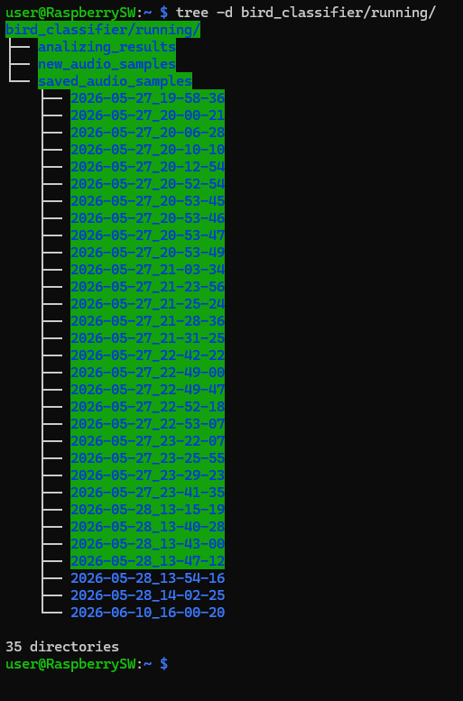<br>
  <sub><b>Figure 11:</b> Console output from the tree -d command demonstrating the separation of isolated directories for audio samples from individual dates.</sub>
</p>

---

## 8. User Guide and Field Procedures

### Step 1: Booting and Connection

1.  Connect the system to the power source (Xiaomi Powerbank). Wait approximately 40–60 seconds for system processes to initialize completely.
2.  On a phone or computer, search for the Wi-Fi network named **`DrzewoBirdNET`** and log in with the password **`HasloDoDrzewa`** (in accordance with the attached `connected_wifi.png` screenshot from chapter 7.1). Ignore the system alert regarding the lack of internet access.

### Step 2: Data Monitoring (Three Access Methods)

- **Web Application (Recommended):** Open any browser (Chrome, Safari, Edge) and navigate to `http://10.42.0.1:5173`. You will access a full, responsive dashboard (according to files `screens/birds_found_1.png`, `screens/birds_found_2.png`, and the mobile view `screens/IMG_5700.jpg`). Choose the desired session from the side menu to browse statistics and listen to trimmed bird samples.
- **Windows Explorer:** Type `\\10.42.0.1\Raspberry` into the address bar of your file manager. After providing the user credentials for `user`, you will get native access to the directory structure (view `screens/samba_windows.png`).
- **Terminal Panel (SSH):** To perform diagnostics, connect via the SSH protocol: `ssh user@10.42.0.1`.

### Step 3: Data Export and Storage Maintenance

Flash memory management takes place in a dedicated control section within the sidebar menu:

<p align="center">
  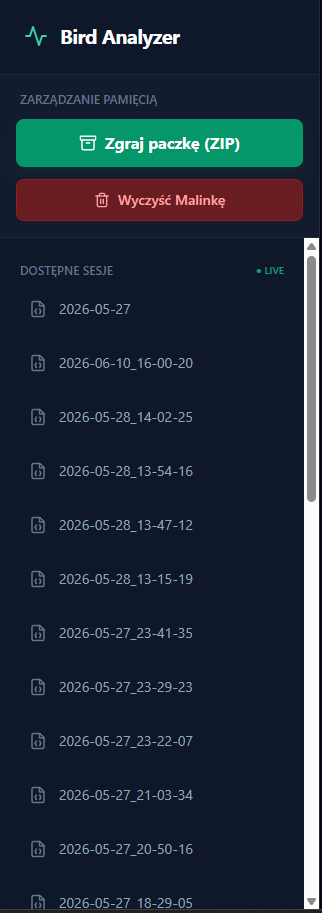<br>
  <sub><b>Figure 12:</b> Administrative tools for saving and deleting logs located in the left panel of the dashboard.</sub>
</p>

1.  In the sidebar of the application, click the green button **"Zgraj paczkę (ZIP)"** (Export package (ZIP)).
2.  The system will generate and download a compressed collective archive directly onto your device:

<p align="center">
  <br>
  <sub><b>Figure 13:</b> Browser download monitor for the archive file ZGRANE_PTAKI_SD.zip with a size of 5.3 MB via the system API.</sub>
</p>

3.  The layout of the unpacked archive provides a structured division of the measurement data:

<p align="center">
  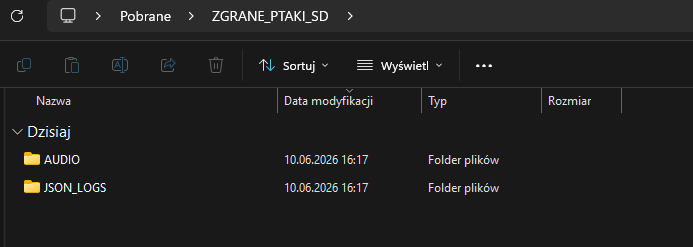<br>
  <sub><b>Figure 14:</b> Main workspace of the exported ZIP package containing the AUDIO and JSON_LOGS directories.</sub>
</p>

<p align="center">
  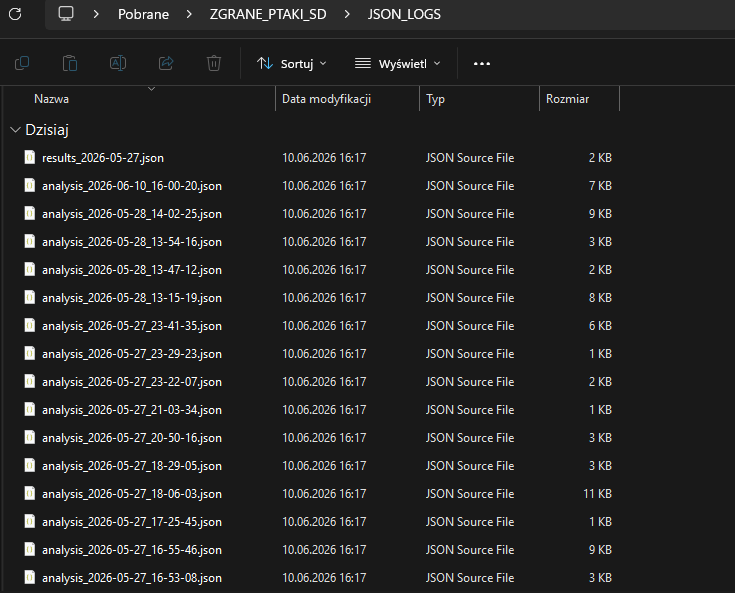<br>
  <sub><b>Figure 15:</b> All chronological JSON text session files correctly packed into the reports folder.</sub>
</p>

<p align="center">
  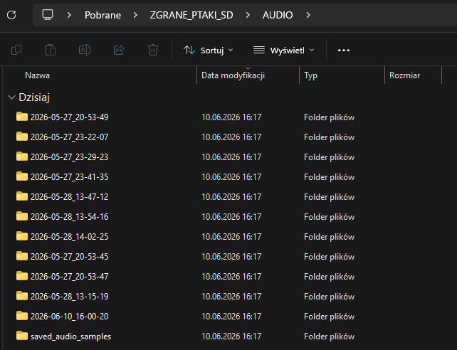<br>
  <sub><b>Figure 16:</b> Audio sample directories segregated by the timestamp of their field registration.</sub>
</p>

<p align="center">
  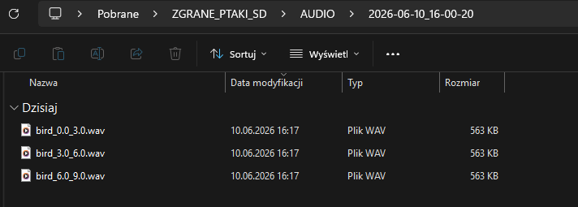<br>
  <sub><b>Figure 17:</b> Individual audio files cut automatically by the segmentation function (log_reader.py) for specific detected birds.</sub>
</p>

4.  After making sure that the data has been fully archived on your client device (phone/computer), press the red button **"Wyczyść Malinkę"** (Clear Raspberry). Confirm the critical data deletion operation in the dialog box:

<p align="center">
  <br>
  <sub><b>Figure 18:</b> System JavaScript prompt protecting against accidental deletion of non-copied data in the field.</sub>
</p>

<p align="center">
  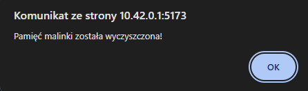<br>
  <sub><b>Figure 19:</b> Feedback indicating the successful execution of the cascading storage wipe.</sub>
</p>

5.  The SD card will be completely freed of current data, which restores the application and the file system of the minicomputer to a clean entry state:

<p align="center">
  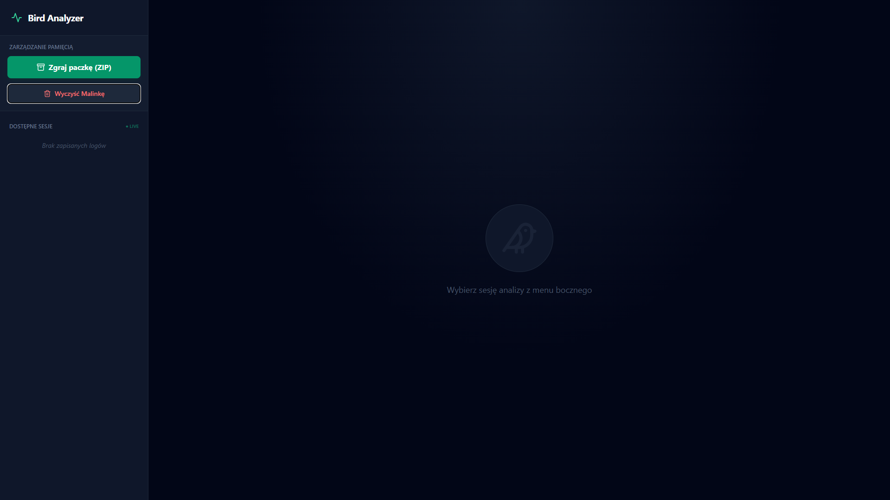<br>
  <sub><b>Figure 20:</b> Operational dashboard immediately after clearing the database (clean state, no available sessions).</sub>
</p>

<p align="center">
  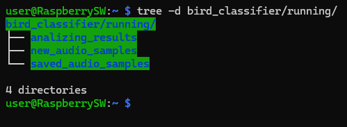<br>
  <sub><b>Figure 21:</b> Terminal verification using tree -d confirming the cascade removal of dynamic session subfolders.</sub>
</p>
