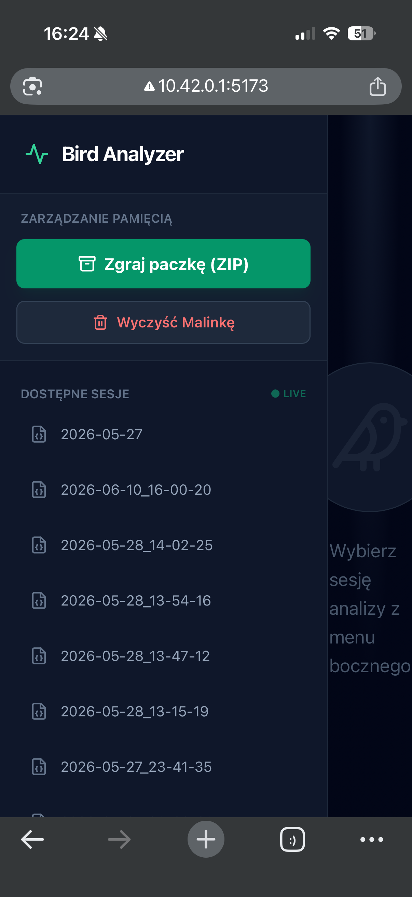

<p align="center">🇬🇧 <b>English:</b> <a href="README.md">Documentation</a> • <a href="Raspberry_config.md">Configuration</a> │ 🇵🇱 <b>Polski:</b> <a href="README.pl.md">Dokumentacja</a> • <a href="Raspberry_config-PL.md">Konfiguracja</a></p>

---

# Embedded Bird Classifier

**Project Authors:** Emil Siatka, Mateusz Szwagierczak  
**Release Date:** June 2026  
**System Version:** 1.0.0  
**Base Platform:** Raspberry Pi 4 Model B (2GB RAM)  
**Operating System:** Raspberry Pi OS (64-bit, Debian Bookworm based)

---

## 1. Introduction and Project Objective

The **Embedded Bird Classifier** project is an autonomous embedded device designed for continuous environmental audio recording and automatic bird species recognition. The sounds of recognized birds are saved along with timestamps, identified species, and classification confidence scores. The system is engineered to operate in field conditions without internet access or a continuous mains power supply.

### Main Functional Features:

- Cyclic recording of ambient audio samples using a connected microphone.
- Bird classification based on recordings, processed in real-time directly on the Raspberry Pi using the `BirdNet` model.
- Storage of segmented audio samples and logs in JSON format.
- Independent Wi-Fi hotspot deployment to review results on a smartphone or computer without an internet connection, or to download data as a ZIP archive.

---

## 2. Hardware Specification and Architecture

The device features a modular design built on easily accessible components, making the setup straightforward to replicate.

| Component | Model / Manufacturer | Role in the System | Technical Specification / Notes |
| :--- | :--- | :--- | :--- |
| **Central Unit** | Raspberry Pi 4 Model B | Main minicomputer; runs processes, handles audio analysis, hosts API/Web server. | Broadcom BCM2711 (Quad-core Cortex-A72 @1.5GHz), 2GB LPDDR4 RAM, built-in 2.4/5.0 GHz Wi-Fi. |
| **Power Unit** | Xiaomi Power Bank | Power source; acts as a UPS buffer. | Supports pass-through charging (simultaneously charges the power bank and powers the minicomputer from an external source). |
| **Microphone** | Esperanza Lavalier Microphone | Captures bird vocalizations from the environment. | Omnidirectional polar pattern, frequency response optimized for capturing nature sounds. |
| **Sound Card** | LogiLink USB Sound Card | Converts analog microphone signals to digital format. | Plug&Play operation under Linux, dedicated 3.5 mm TRS microphone input. |
| **Enclosure** | S-BOX Electrical Junction Box (Pawbol) | Protects components from rain and moisture. | IP65 ingress protection rating, made of durable polypropylene. |

### Assembly and Weatherproofing:

Components inside the S-BOX enclosure are secured with zip ties to prevent movement during transit. The microphone cable is routed outside through a factory rubber cable gland. The exit point and enclosure seams are sealed with hot glue to safeguard the interior against humidity. Outside the box, the microphone is shielded by a perforated protective mesh cover.

#### Hardware Component Visuals:

<p align="center">
  <br>
  <sub><b>Figure 1:</b> Closed S-BOX enclosure with the microphone routed at the bottom.</sub>
</p>

<p align="center">
  <br>
  <sub><b>Figure 2:</b> Layout of the Raspberry Pi 4, power bank, and USB sound card inside the enclosure.</sub>
</p>

---

## 3. Software Architecture and Tech Stack

The system consists of independent background system services and application modules working cooperatively.

### Tech Stack:

- **Operating System:** Raspberry Pi OS (64-bit). Power-saving features are disabled (`systemctl mask` for acpi/sleep) to prevent the device from entering sleep mode in the field.
- **Backend:** Python 3.11+ running inside a virtual environment (`venv`). Main libraries: `birdnetlib` (manages the BirdNet TensorFlow Lite recognition model), `watchdog` (automatically detects new audio files), `sounddevice` and `scipy` (audio recording and WAV generation), `pydub` (audio segment slicing), `FastAPI` (handles frontend communication), `uvicorn` (Web server).
- **Frontend:** Single Page Application built with `React` using `Vite`. Styling is managed via `TailwindCSS`, icons are provided by `Lucide React`, and charts are rendered using `Recharts`.

### Project Directory Structure:

```text
/home/user/bird_classifier/
├── autorun_logs.md                 # Autostart diagnostic logs
├── bird_images/                    # Local database of bird images for the UI
├── .env                            # Configuration and environment variables
├── frontend/                       # React application source code (Vite)
│   ├── index.html
│   ├── package.json
│   ├── tailwind.config.js
│   └── src/
│       ├── App.jsx                 # Main user dashboard logic
│       ├── main.jsx
│       └── index.css
├── frontend.log                    # Vite server runtime logs
├── Raspberry_config-EN.md          # System installation guide
├── requirements.txt                # List of Python dependencies
├── run.sh                          # Main startup script launching all processes
├── setup.sh                        # Automated Pi configuration script
├── src/                            # Core backend scripts
│   ├── __init__.py
│   ├── analyzer.py                 # Bird recognition and file detection logic
│   ├── log_reader.py               # Audio segment extraction (pydub)
│   ├── recorder.py                 # Continuous ambient audio recording
│   └── server.py                   # FastAPI server handling frontend requests
└── running/                        # Runtime work directory
    ├── export.zip                  # Temporary ZIP package for data download
    ├── analizing_results/          # JSON files containing recognition results
    ├── new_audio_samples/          # Buffer directory for raw 9-second WAV files
    └── saved_audio_samples/        # Session folders containing sliced audio clips
```

The following terminal screenshot verifies the correct file structure layout and executable permissions configured for the `.sh` scripts:

<p align="center">
  <br>
  <sub><b>Figure 3:</b> Directory structure and file execution permissions in the terminal.</sub>
</p>

---

## 4. System Data Flow

The device processes incoming data continuously according to the following diagram:

```text
[ Environment ]
       │ (Analog Audio)
       ▼
[ Mic + USB Sound Card ] ──(48kHz PCM)──> [ src/recorder.py ]
                                                 │
                                                 ▼ (Saves audio_*.wav every 9 seconds)
                                          [ running/new_audio_samples/ ]
                                                 │
                                                 ▼ (Watchdog detects new file)
                                          [ src/analyzer.py ]
                                                 │
                    ┌────────────────────────────┴────────────────────────────┐
                    ▼ (BirdNet TFLite Analysis)                               ▼ (Segment Extraction)
           [ Classification Results ]                                  [ src/log_reader.py ]
                    │                                                         │
                    ▼ (Append to file)                                        ▼ (Save small WAV clip)
     [ running/analizing_results/analysis_*.json ]               [ running/saved_audio_samples/[Session]/ ]
                    │                                                         │
                    └────────────────────────────┬────────────────────────────┘
                                                 ▼
                                         [ FastAPI Server ]
                                                 │
                                                 ▼ (Data served over HTTP)
                                       [ User Dashboard (React) ]
```

1. **Audio Recording:** The `recorder.py` script initializes a 48 kHz mono recording stream. Every 9 seconds, it flushes the buffer to a file named `audio_[TIMESTAMP].wav` inside the temporary `new_audio_samples` directory.
2. **File Detection:** The `analyzer.py` script leverages the `watchdog` module to monitor `new_audio_samples`. When a new `.wav` file appears, the script pauses for one second (ensuring the OS has finished writing the file to disk) and passes it to the BirdNet model.
3. **Bird Recognition:** The `BirdNetLib` library executes a local TensorFlow Lite instance. Geographic coordinates are fed into the model (defaulting to Warsaw: lat=52.2297, lon=21.0122) to automatically filter out bird species not present in the region, significantly reducing false positives. These coordinates can be adjusted via the `.env` file.
4. **Logging and Slicing:** If the model matches a bird with sufficient confidence, the metadata is appended to `analysis_[SESSION].json`. Simultaneously, the `log_reader.py` module uses `pydub` to isolate the exact timestamp range where the bird vocalization was detected, saving it as a short, standalone `.wav` clip.

The JSON payload schema encapsulates comprehensive data regarding the detected species and classification score:

<p align="center">
  <br>
  <sub><b>Figure 4:</b> Layout of the JSON data structure served to the frontend application.</sub>
</p>

5. **Displaying Results:** The FastAPI server exposes API endpoints and manages static file downloads. The React user dashboard polls the server every 5 seconds, dynamically updating the metrics, charts, and the list of playable recordings.

---

## 5. Backend Implementation (Python)

### 5.1. `src/recorder.py`

This script interfaces with the USB sound card to record environmental audio.

```python
# Audio recording buffer mechanism and disk output
def record(device_id):
    samplerate = 48000
    channels = 1
    timestamp = datetime.now().strftime("%Y%m%d_%H%M%S")
    file_path = os.path.join(FOLDER_AUDIO, f"audio_{timestamp}.wav")
    recording_buffer = []

    def callback(indata, frames, time_info, status):
        # Calculate volume metrics and display a simple VU meter in the console
        volume_norm = np.linalg.norm(indata) * 20 / np.sqrt(len(indata))
        recording_buffer.append(indata.copy())
        level = min(int(volume_norm * BAR_LENGTH), BAR_LENGTH)
        bar = "█" * level + "-" * (BAR_LENGTH - level)
        print(f"\rRecording (ID:{device_id}): [{bar}]", end="", flush=True)

    with sd.InputStream(samplerate=samplerate, channels=channels, callback=callback, device=device_id):
        time.sleep(RECORDING_DURATION)

    full_recording = np.concatenate(recording_buffer, axis=0)
    write(file_path, samplerate, full_recording)
```

### 5.2. `src/analyzer.py`

The main orchestrator handling audio analysis and coordinating file system outputs.

```python
class BirdWatchHandler(FileSystemEventHandler):
    def on_created(self, event):
        if event.is_directory or not event.src_path.lower().endswith(".wav"):
            return

        time.sleep(1) # Wait for SD card write operation to finalize
        try:
            recording = Recording(analyzer, event.src_path, lat=52.2, lon=21.0)
            recording.analyze()

            if recording.detections:
                # Append new detections to the active JSON session log
                if not os.path.exists(file_path):
                    with open(file_path, "w", encoding="utf-8") as f: json.dump([], f)

                record_data = {
                    "timestamp": os.path.basename(event.src_path)[6:-4],
                    "file": os.path.basename(event.src_path),
                    "detections": recording.detections
                }

                with open(file_path, "r+", encoding="utf-8") as f:
                    data = json.load(f)
                    data.append(record_data)
                    f.seek(0)
                    json.dump(data, f, indent=4, ensure_ascii=False)
                    f.truncate()

                # Slice the exact audio fragment containing the bird call
                segment_audio_parts(recording.detections, event.src_path, SESSION_WAV_DIR, f"{os.path.basename(event.src_path)[:-4]}")
        except Exception as e:
            print(f"Analysis error: {e}")
```

### 5.3. `src/server.py`

The FastAPI server exposes endpoints for the web app, coordinates file aggregation, and handles system data wipes.

- `GET /api/results`: Returns a listed index of active sessions (`.json` files), ordered chronologically.
- `GET /api/export`: Archives all system analytics logs and audio snippets on-the-fly into a single ZIP file for seamless extraction.
- `DELETE /api/clear`: Flushes the active contents of the results and recordings directories, prepping the local storage for a clean session.

---

## 6. User Interface (Frontend - React)

### Core UI Mechanics in `App.jsx`:

1. **Background Refresh Management:** A React `useRef` reference holds the active session state. This ensures that the background polling interval (`setInterval` firing every 5 seconds) always pulls updates relevant to the current session view without triggering UI blinks or view state resets.
2. **Chart Data Compilation:** The `generateChartData` routine aggregates bird species metrics within the current session, feeding structured arrays directly into the `<BarChart>` component provided by `recharts`.
3. **Cache Busting Strategy:** Audio playback links and JSON reports are appended with an ephemeral timestamp query parameter (`?t=${new Date().getTime()}`). This prevents mobile web browsers from aggressive asset caching, forcing them to always read real-time data chunks.

#### Dashboard Interface States:

<p align="center">
  <br>
  <sub><b>Figure 5:</b> Main web panel interface prior to selecting an active data session.</sub>
</p>

<p align="center">
  <br>
  <sub><b>Figure 6:</b> Active session dashboard displaying classification distribution charts and a rolling timeline.</sub>
</p>

<p align="center">
  <br>
  <sub><b>Figure 7:</b> Detailed view displaying local reference imagery matching a verified bird detection.</sub>
</p>

<p align="center">
  <br>
  <sub><b>Figure 8:</b> Responsive presentation layout of the control panel optimized for mobile browser screens.</sub>
</p>

---

## 7. System Environment, Autostart, and Deployment

The device functions autonomously by leveraging custom system services and network daemon configurations at the OS layer. Below is the comprehensive step-by-step installation guide.

### 7.1. Package Repository Synchronization and Dependencies
Synchronize your package trees, upgrade current dependencies, and install audio interfaces, media decoders, file server daemons, and formatting conversion tools:
```bash
sudo apt update && sudo apt upgrade -y
sudo apt install libportaudio2 ffmpeg samba samba-common-bin dos2unix -y
```

### 7.2. Permissions Cleanup and Source Normalization
Source files authored inside Windows environments often carry carriage return line endings (CRLF), which cause interpreter faults under Linux. Normalize them (LF) and apply binary execution flags:
```bash
# Hand over project tree ownership to user 'user'
sudo chown -R user:user /home/user/bird_classifier

# Grant execution flags to system management shell scripts
chmod +x /home/user/bird_classifier/run.sh
chmod +x /home/user/bird_classifier/setup.sh

# Force Unix line ending conversion
sudo dos2unix /home/user/bird_classifier/run.sh
sudo dos2unix /home/user/bird_classifier/setup.sh
```

### 7.3. Isolated Python Environment Configuration (venv)
The execution backend isolates its requirements within a local python virtual container:
```bash
cd /home/user/bird_classifier
python3 -m venv venv
source venv/bin/activate
pip install -r requirements.txt
```

### 7.4. USB Microphone Hardware Discovery
To feed the capture thread correctly, identify the card configuration identifier. Inside your virtual environment, run:
```bash
python3 -c "import sounddevice as sd; print(sd.query_devices())"
```
Take the corresponding index value or hardware string literal (e.g., "USB Audio Device") and set it inside the `run.sh` initialization argument flag: `RECORDER_ARGS="-m <device_identifier>"`.

### 7.5. Power Management Interlock Configuration
Field deployment parameters require the minicomputer network cards and processor lines to remain active without scaling down:
```bash
sudo systemctl mask sleep.target suspend.target hibernate.target hybrid-sleep.target
```

### 7.6. Network Configuration (Independent Wireless Hotspot)
Using NetworkManager (`nmcli`), transition the local wireless interface `wlan0` to run a localized Access Point (AP). Setting the `autoconnect` property ensures the network self-heals after power disruptions:
```bash
sudo nmcli device wifi hotspot ifname wlan0 ssid DrzewoBirdNET password HasloDoDrzewa
sudo nmcli connection modify Hotspot connection.autoconnect yes
```
The static gateway IP for the Raspberry Pi within this access point connection topology defaults to `10.42.0.1`.

<p align="center">
  <br>
  <sub><b>Figure 9:</b> Mobile client connecting directly to the local hotspot broadcasted by the device.</sub>
</p>

### 7.7. Network Shares Provisioning (Samba Core)
To allow cross-platform data extraction directly to Windows clients over local radio, append a network share block inside `/etc/samba/smb.conf`:
```ini
[Raspberry]
   path = /home/user
   writeable = yes
   browseable = yes
   public = no
   create mask = 0644
   directory mask = 0755
   force user = user
```
Finalize the network credentials for the system account and bounce the daemon engine:
```bash
sudo smbpasswd -a user
sudo systemctl restart smbd
```

<p align="center">
  <br>
  <sub><b>Figure 10:</b> Exploring the project data share directly inside Windows File Explorer.</sub>
</p>

### 7.8. Systemd Core Automation Daemon
The systemd init manager monitors the health of the core `run.sh` process stack, starting it automatically upon hardware boot. Define the service tracking configuration block inside `/etc/systemd/system/birdnet.service`:
```ini
[Unit]
Description=Embedded Bird Classifier
After=network.target sound.target

[Service]
Type=simple
User=user
WorkingDirectory=/home/user/bird_classifier
ExecStart=/bin/bash /home/user/bird_classifier/run.sh
Restart=on-failure
RestartSec=10

[Install]
WantedBy=multi-user.target
```
Commit the unit registration changes and boot the tracking engine:
```bash
sudo systemctl daemon-reload
sudo systemctl enable birdnet.service
sudo systemctl start birdnet.service
```

Captured audio samples are processed, chunked, and dynamically organized inside separate session folders tracking runtime dates:

<p align="center">
  <br>
  <sub><b>Figure 11:</b> Previewing organized session data trees using the terminal interface.</sub>
</p>

---

## 8. User Manual and Field Procedures

### Step 1: Boot Sequence and Device Association
1. Connect the power management board to the battery pack line. Allow approximately 40–60 seconds for the OS init pipeline to stabilize.
2. Open your client hardware settings panel, search for the Wi-Fi network named **`DrzewoBirdNET`**, and authenticate using the passkey **`HasloDoDrzewa`**. Disregard alerts regarding the absence of global internet connectivity.

### Step 2: Data Retrieval Methods (Three Options)
- **Web Dashboard (Recommended):** Fire up a web browser client and visit `http://10.42.0.1:5173`. Select your target data logging session from the sidebar menu to populate visualization charts and preview individual audio clips.
- **Native File Explorer (Windows):** Navigate your file browser client path directly to `\\10.42.0.1\Raspberry`. Provide your standard shell account credentials (`user`) to explore local directories.
- **Secure Shell (SSH Terminal):** For administrative maintenance routines, connect via an SSH client: `ssh user@10.42.0.1`.

### Step 3: Data Export and Storage Management
Data export operations are clustered in the left control column of the web application dashboard:

<p align="center">
  <br>
  <sub><b>Figure 12:</b> Control layout buttons managing archive exporting and file system clearing routines.</sub>
</p>

1. Trigger the green **"Zgraj paczkę (ZIP)"** export button.
2. The server script compresses system files and starts downloading the archive package to your device:

<p align="center">
  <br>
  <sub><b>Figure 13:</b> Browser pipeline downloading the compiled runtime ZIP asset folder.</sub>
</p>

3. Extracting the generated zip file yields a structured file hierarchy tracking application metrics and recording files:

<p align="center">
  <br>
  <sub><b>Figure 14:</b> Internal asset layout layout previewed following archive extraction.</sub>
</p>

<p align="center">
  <br>
  <sub><b>Figure 15:</b> Processed JSON tracking reports generated during field analysis.</sub>
</p>

<p align="center">
  <br>
  <sub><b>Figure 16:</b> Audio capture segments parsed into categorical directories tracking run dates.</sub>
</p>

<p align="center">
  <br>
  <sub><b>Figure 17:</b> Segmented short WAV audio captures indexing isolated bird songs.</sub>
</p>

4. Once you verify that the download package contains the complete session data on your local machine, clear the remote environment by clicking the red **"Wyczyść Malinkę"** button and confirm the modal warning:

<p align="center">
  <br>
  <sub><b>Figure 18:</b> Warning prompt preventing unintended storage deletion actions.</sub>
</p>

<p align="center">
  <br>
  <sub><b>Figure 19:</b> Success confirmation layout confirming storage formatting completion.</sub>
</p>

5. Remote file spaces are systematically initialized back to a zero state, reverting the web interface to its idle mode:

<p align="center">
  <br>
  <sub><b>Figure 20:</b> Interface tracking state display showing a blank layout following data cleanup.</sub>
</p>

<p align="center">
  <br>
  <sub><b>Figure 21:</b> Terminal directory path validation confirming empty session directories.</sub>
</p>

### 8.4. Essential SSH Maintenance Routines
- **Poll daemon service execution metrics:** `sudo systemctl status birdnet.service`
- **Track runtime pipeline outputs on-the-fly:** `journalctl -u birdnet.service -f`
- **Force daemon service restart cycle:** `sudo systemctl restart birdnet.service`
- **Initiate safe hardware power down:** `sudo shutdown -h now`
```